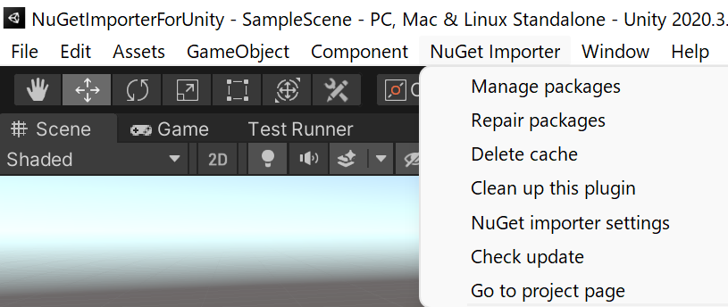
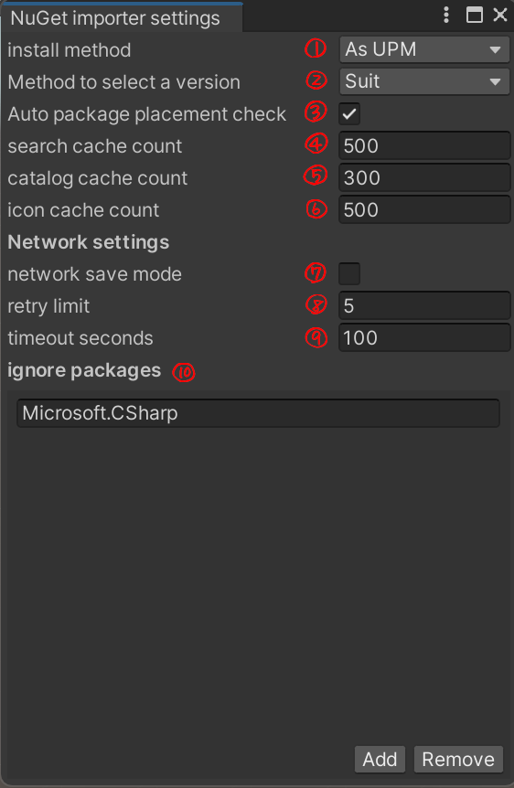

# NuGet importer for Unity

 
 "NuGet importer for Unity" is a fast, easy to use, and very powerful editor extension that provides you to import NuGet packages into Unity.
This is also fully support for native plugins.
(This was inspired by [GlitchEnzo/NuGetForUnity](https://github.com/GlitchEnzo/NuGetForUnity), but made from scratch.)  
[日本語はこちら。](README_jp.md) 

## Features

- High performance using asynchronous
- Powerful dependency solving
- Full support for native plugins
- Useful UI
- UPM and unitypackage support
- Compatible with [GlitchEnzo/NuGetForUnity](https://github.com/GlitchEnzo/NuGetForUnity)

## Usage

### Menu item

- Manage packages ・・・ Open the main window for managing packages.
- Repair packages ・・・ Optimize the dependencies of installed packages and repair them.
- Delete cache ・・・ Delete the cache. (However, the cache is deleted every time the assembly is loaded.)
- NuGet importer settings ・・・ Open the window for configuring settings with NuGet importer.
- Check update ・・・ Check for updates.
- Go to project page ・・・ Open the "NuGet importer for Unity" page.

### Main window

1. Mode to search from NuGet.
1. Mode to search from the installed packages.
1. Whether include development version.
1. Input area for search words. (Incremental search.)
1. Search results.
1. Package details.
1. Version selection.
1. Operations on the package.

### NuGet importer settings

1. Specify the installation location. （It is recommended to use UPM.)
1. Specify the method for determining the package version when solve dependency. (Suit is recommended.)
1. The maximum number of search results to cache. (0 or less is not cached.)
1. The maximum number of catalog to cache. (0 or less is not cached.)
1. The maximum number of icon to cache. (0 or less is not cached.)

## Note

Files that are not required at runtime (e.g. analyzers, documentationn, etc.) are installed to `(your project)/NuGet`. If you want to reference them, add them reference manually.

When importing this package into your project, make the following changes
- Turn off `PlayerSettings -> assemblyVersionValidation`. (To make Unity not check version of assembly as NuGet does.)
- Add reference `System.IO.Compression.FileSystem.dll`. (NuGet importer for Unity handles Zip files.)

## License

This is [Apache License 2.0](../LICENSE.md).  
Each package in NuGet is governed by the terms that are included with the package. For more details, see [NuGet F&Q](https://docs.microsoft.com/en-us/nuget/nuget-org/nuget-org-faq#license-terms).