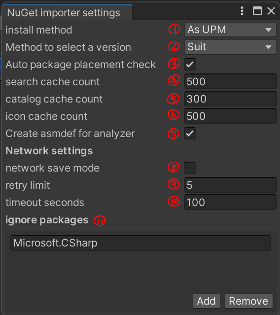

# 使い方

## インストール方法

 パッケージをインストールするには、UPM (Unity Package Manager) を利用する、または、.unitypackage をインポートするの二通りがあります。

### UPM (Unity Package Manager) を使う

 UPMを使って導入するには、この Git URL を指定する。または、OpenUPM を使って導入するという二通りあります。

#### Git URL を指定する

1. Package Manager ウィンドウを開く
1. ステータスバーの **Add** (+) ボタンをクリック
1. **Add package from git URL** を選択
1. 「`https://github.com/kumaS-nu/NuGet-importer-for-Unity.git?path=NuGetImporterForUnity/Packages/NuGet Importer`」または「`git@github.com:kumaS-nu/NuGet-importer-for-Unity.git?path=NuGetImporterForUnity/Packages/NuGet Importer`」を入力
1. **Add** をクリック

詳細は[公式ページ(Git URL からのインストール - Unity)](https://docs.unity3d.com/ja/2019.4/Manual/upm-ui-giturl.html)をご覧ください。

#### OpenUPM を利用する

1. OpenUPM-CLI をインストールしていない場合は、以下のコマンドで OpenUPM-CLI をインストールする。(Node.js 12が必要です。)
    ``` bash
    npm install -g openupm-cli
    ```
1. インストールする予定のプロジェクトのフォルダへ移動する。
1. 以下のコマンドで、プロジェクトにインストールする。
    ``` bash
    openupm add org.kumas.nuget-importer
    ```

詳細は[公式ページ(Getting Started with OpenUPM-CLI - OpenUPM)](https://openupm.com/docs/getting-started.html)をご覧ください。

### .unitypackage で導入する

1. [リリースページ](https://github.com/kumaS-nu/NuGet-importer-for-Unity/releases)へ行き、必要なバージョンのzipファイルをダウンロードする。
1. zipファイルを解凍し、中の .unitypackage をプロジェクトにインポートする。

## .gitignoreの設定

インストールしたパッケージは Git の監理外にしたいと思います。その場合は、`.gitignore`に以下を追加してください。インストールしたパッケージ一覧は`Asset/package.config`で管理され、このファイルを共有すればパッケージの復元ができます。
```bash
# NuGet importer
/[Aa]ssets/[Pp]ackages.meta
/[Aa]ssets/[Pp]ackages/

/[Nn]u[Gg]et/

/[Pp]ackages/*/
!/[Pp]ackages/your embedded package to share with git/
```

ただし、パッケージを Git の監理外にするとそのままではコンパイルエラーが発生し CI/CD に使用できません。
そのため、パッケージを Git の監理外にし CI/CD をする際は以下の3つの対応策のうちどれかを行ってください。

1. バッチモードの起動オプションに `-ignoreCompilerErrors` を追加。
1. 導入したパッケージに依存する .asmdef の `Define Constraints` に `NUGET_PACKAGE_READY` を追加。
1. 導入したパッケージに依存するコードを以下のようにプリプロセッサディレクディブで囲う。
    ```csharp
    #if NUGET_PACKAGE_READY

    // your code

    #endif
    ```

## Unityでの使い方

### メニューアイテム


- Manage packages ・・・ パッケージを管理するメインウィンドウを表示する。
- Repair packages ・・・ インストールされていないパッケージを修復する。
- Delete cache ・・・ キャッシュを削除する。（ただし、アセンブリがロードされるたびにキャッシュは消える。）
- Clean up this plugin ・・・ パッケージを全削除し、このプラグインを初期化する。
- NuGet importer settings ・・・ NuGet importer に関する設定をするウィンドウを表示する。
- Check update ・・・ 更新があるか確認する。
- Go to project page ・・・ NuGet importer for Unity の Web ページを開く。

### メインウィンドウ


1. NuGet から検索するときのモード。
1. インストールされているものから検索するときのモード。
1. 非安定版も含めるかどうか。
1. 検索語句の入力場所。（インクリメンタルサーチされる。）
1. 検索結果。
1. パッケージの詳細情報。
1. バージョン選択。
1. パッケージに対する操作。


### NuGet importer の設定



1. インストール先を指定する。（UPMを推奨。）
1. 依存関係のバージョン決定方法を指定する。（Suitを推奨。）
1. 起動時にパッケージがインストールされているか確認するか。パッケージのディレクトリが存在すればインストール済みと判断。インストールされていないパッケージを見つけた場合、自動的に修復する。（オンを推奨。）
1. 検索結果のキャッシュする最大数。（0以下はキャッシュしない。）
1. カタログのキャッシュする最大数。（0以下はキャッシュしない。）
1. アイコンのキャッシュする最大数。（0以下はキャッシュしない。）
1. 通信のデータ量を少なくするモードか。オンの場合、インストールされていないパッケージの画像が取得されなくなり、入力が落ち着くまでパッケージ検索が行われなくなります。
1. 通信失敗時に再度通信を試みる最大数。
1. 通信のタイムアウトとする秒数。

## 注意点

実行時に必要なファイル以外（例：ルールセットやドキュメントなど）は `(your project)/NuGet` 以下に配置されます。参照する際は手動で追加してください。

このパッケージを導入する際、以下の変更を加えます。
- `PlayerSettings -> assemblyVersionValidation` をオフに。（NuGet と同様にアセンブリ参照のバージョンの同一性をチェックしなくさせるため。）
- `System.IO.Compression.FileSystem.dll` を参照に追加。（NuGet importer for Unity が Zip ファイルを扱うため。）